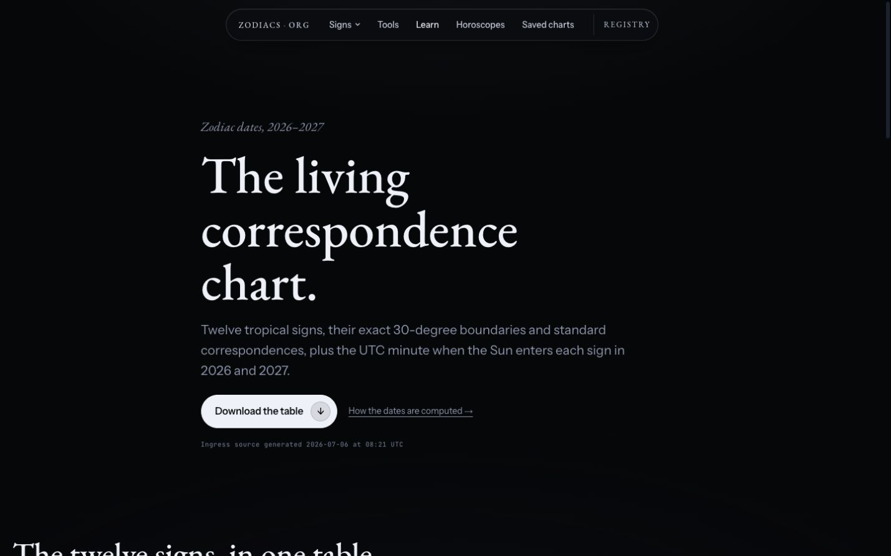
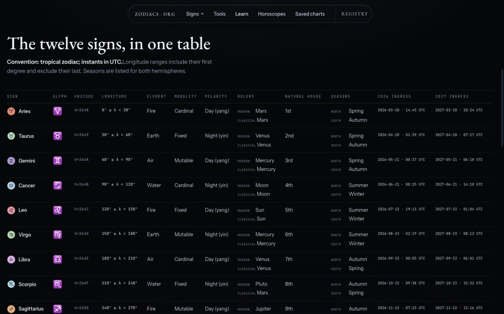
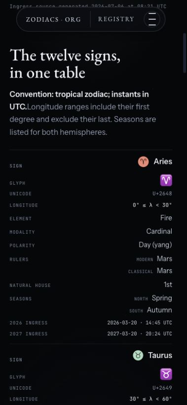

# T-21 / T-22 acceptance — zodiac reference and contextual links

Baseline: origin/main at 5bdc1b8.

## T-21 — Living Correspondence Chart

- /learn/zodiac-dates/ renders one static .rx-table with all twelve signs,
  canonical correspondences, and the exact 2026/2027 Sun ingress minutes from
  the committed src/data/ingresses.json receipt.
- The table uses sign row headers, fits without horizontal overflow at the
  verified 1429 px desktop viewport, and becomes label/value rows at 379 px.
- The page has no Astro island or module preload. Shared Base/Nav behavior is
  unchanged.
- /learn/zodiac-dates/zodiac-dates.csv is prerendered from the same model:
  HTTP 200, text/csv, 2,180 bytes, one header plus twelve sign rows.
- The learn hub, footer Learn column, and sitemap point to the page. The
  Spanish footer explicitly marks the English-only target.

### Schema validator output

Reproducible after npm run build with
node tests/t21-zodiac-dates.mjs:

~~~text
schema-validator: Article PASS — 11 required fields; 0 errors
schema-validator: Dataset PASS — 14 required fields; 0 errors
schema-validator: DataDownload PASS — CSV resolves; 12 data rows; minute-precision UTC
page-contract: PASS — 12 row headers; convention present; zero island JS
schema-validator: 0 errors, 0 warnings
~~~

The Dataset chronology is explicit: source data created
2026-07-06T08:21:32.509Z; page and dataset published/modified 2026-07-11.
Its DataDownload.contentUrl is the canonical CSV URL.

### Screenshots

Desktop hero:

Desktop table with both ingress years:

Mobile stacked table:

## T-22 — contextual-link proof

Source and built-output grep checks:

~~~text
EN sign-guide profile targets: 12
EN rising-calculator hub targets retained: 12
EN profile slugs: aquarius aries cancer capricorn gemini leo libra pisces sagittarius scorpio taurus virgo
ES guide → direct EN rising profile targets: 12
Homepage built links: href="/birthday/" · href="/eclipses/"
New ES routes: 0
~~~

The homepage additions stay inside the existing tools and closing sections.
The tools strip reuses the /tools/ “And for the month ahead” idiom.

## Gates

- npm run check: 0 errors, 0 warnings, 3 pre-existing hints.
- T-21 model tests: 4/4 pass.
- Full unit suite: 230/231 pass locally. The sole failure is the inherited
  Darwin Astronomy Engine floating-point delta in the frozen Kahlo scene
  snapshot; this branch changes no scene or engine file. Linux CI is the
  authoritative full-suite gate.
- npm run build: 944 pages.
- node scripts/check-dist.mjs: 961 HTML files, 9 feed items, registry intact.
- node scripts/report-bundles.mjs --fail: all route/chunk/engine budgets pass.
- npm run test:visual: 9/9 pass at 0.0000% after reviewed baseline refresh.
- git diff --check: clean.

All nine Darwin visual baselines changed intentionally. This branch changes
the shared footer in every capture, the homepage tools/closing links, and the
Aries rising-profile copy. The refresh also catches the Darwin baselines up
to already-merged main behavior that they had not recorded: the dated
SkyTicker receipt, Chart Explorer/tour controls, and the editorial line.
No unrelated product code was changed for that catch-up.

The first Linux CI run isolated six expected product diffs: the three
homepage captures record the new eclipse and birthday links, and the three
Aries captures record the direct rising-profile link. Those six baselines
were refreshed from the uploaded CI actuals. All three Linux birth-chart
captures already passed and were deliberately left untouched.
