# Astrofolio redesign: four directions

**Decision (2026-09-23):** the owner chose **B, Campaign**. It is built into the live page: `src/app.jsx` (the `Campaign*` components), `src/terminal/split-styles.css` (the "Astrofolio · Campaign" section), and the no-JavaScript shell in `public/astrofolio/index.html`. The prototypes below stay as the design record.

**After launch (2026-09-23):** on every width, the Fomo price alert no longer sits on the phones; it has its own row after them, captioned as on `/fomo/`. Desktop is otherwise unchanged. On phones, the owner asked for the opening and its scroll to follow rolex.com's mobile homepage, from a screen recording:

- The opening ends like a campaign page: the headline set as a tracked line ("THE TWELVE OFFICIAL ZODIACS"), the name "Astrofolio", and one frosted "Discover more" with a moving arrow. The two wide-screen buttons and the paragraph stay on desktop.
- As the page moves on, the film stays in place and dims to about 78%, and the caption rises and fades. The runway comes up over the dimmed film with no sheet behind it, and its looks pop up from below as they reach the screen. Reduced motion keeps the dim and the fade, without the rise or the moving arrow.

**Phones, 2026-09-24:** each look fits one screen: the numeral and dates, the figure, the name and a one-line price, under one slim row of discs. The whole look opens its sign's page. Buying moves to the bag, which stays up over the runway and follows the look in view. Tapping the bag's sign opens a sheet of all twelve. Across the site, the navigation on phones (599.5px and below) is a full-width bar at the top edge. It keeps the same glass: the menu on the left, ZODIACS | ASTROFOLIO on the centre line, and search on the right. It slides away as the page scrolls down and returns as it scrolls up.

- Swiping the looks moves the pastel disc spotlight to the look in the centre. The bag and the address bar follow once the swipe rests. On the pinned desktop stage, passing looks still never changes the chosen sign.

**Headline, explainer and card rise, 2026-09-24:** the headline reads "Twelve signs. Twelve tokens." on every width, in place of "The twelve official Zodiacs.", so a newcomer learns from the first screen that these are tokens. Under the runway, a new section, "What is Astrofolio?", gives three short answers before the page turns to Fomo: what the tokens are, why the zodiac, and how to get one, with a one-line risk note. The middle answer links to the thesis. On phones, the looks now rise with the scroll in two beats, after rolex.com. First the film falls nearly black (to 90%) and the caption lifts away. Then the looks come up from below the screen as solid cards, the next a beat behind, and settle as the runway reaches the top. Reduced motion keeps the dim and the fade, without the rise.

**Share card, 2026-09-24:** from six directions (Film, Cabinet, Season, Faces, Clock and Cosmic eye), the owner chose **Faces** for the image a shared link shows. It is one evergreen card: the twelve portraits of the glyph film, one per sign, in two rows around a band with the wordmark and "Twelve signs. Twelve tokens." `scripts/build-astrofolio-share-card.mjs` renders it from the film. It replaces the seasonal card, and the seasonal cards stay published for links already shared.

**Smoother card rise, 2026-09-26:** people reported that the rise on phones was janky and unreliable. A script used to move the looks on every frame, so they lagged behind the thumb, jumped when the phone's toolbar came and went, and could catch a vertical swipe. Now the browser runs the dim, the caption and the rise as scroll-driven animations, together with the scroll itself. The looks rise together as one row, so a vertical swipe on a look always scrolls the page. The rise is measured against the small viewport, which holds still while the toolbar moves. In browsers without scroll-driven animations, and with reduced motion, the opening scrolls away before the runway and nothing moves on its own.

These are four working prototypes for `/astrofolio/`. Each is built only from assets already in this repository:

- the twelve gold figures (`public/assets/sculptures/`)
- the Astrofolio ring identity
- the constellation maps
- the astronomical-clock films
- the merch renders
- the `/fomo/` material: the glyph film, the app recording, the Verified phone render, the price alert, the friends/holders/thesis screenshots, the store badges, and the fomo mark

Every price, address and date is real. Addresses come from the public Registry, prices from the committed DexScreener snapshot of 23 September 2026, and season times from the Sun's ingress table in `src/data/ingresses.json`.

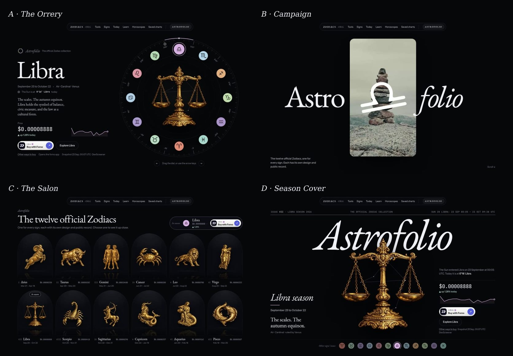

| | Direction | The idea | Signature moment |
|---|---|---|---|
| A | The Orrery | The Astrofolio ring becomes the sign picker | Turn a real ecliptic dial until your sign reaches the top |
| B | Campaign | Launch the collection like a fashion house, with fomo as the store | "Astro [film] folio" opens into the full-screen glyph film |
| C | The Salon | Show all twelve at once, like walking into a gallery | Twelve lit arches; any one opens into a full-screen object label |
| D | Season Cover | A magazine cover that re-issues itself every zodiac season | The season's figure stands in front of the masthead |

## Viewing them

The prototypes are static HTML that read assets straight from `public/`, so serve the repository root:

```bash
python3 -m http.server 8000   # from the repo root
# then open http://localhost:8000/docs/design/astrofolio-redesign/
```

Add `?sign=scorpio` to any prototype to open it on another sign. Nothing here is imported by the Astro build. Branch deployments are switched off in `vercel.json`, so pushing this branch does not produce a preview URL.

## Today's page, for comparison

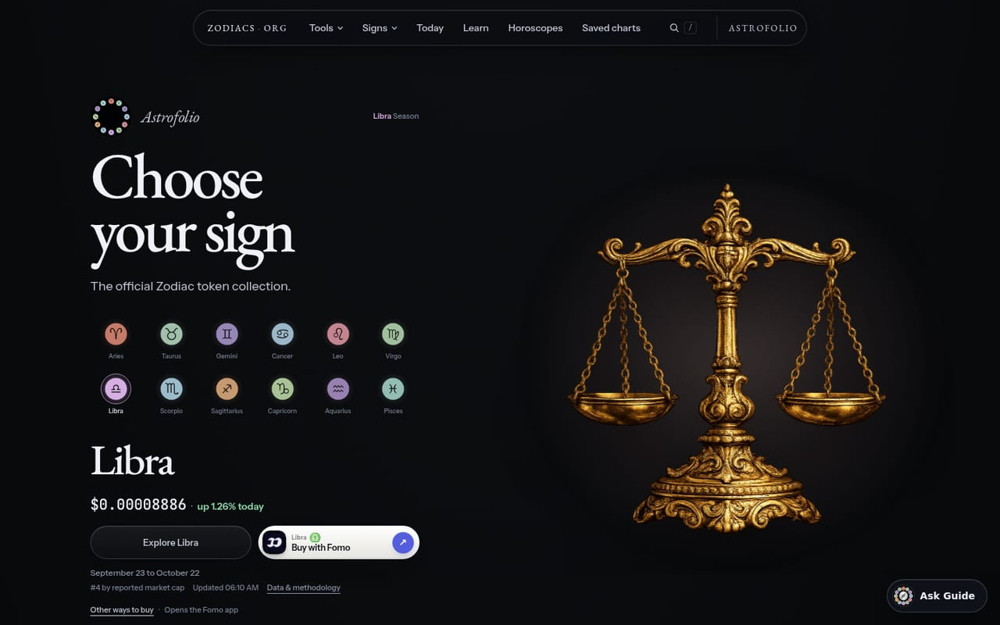 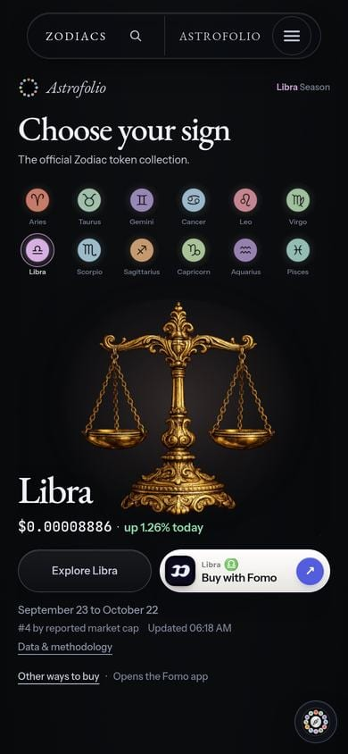

The live page works, but its layout is ordinary:

- **Layout:** a two-column hero, then a stack of similar dark cards.
- **Figures:** the twelve gold figures appear one at a time.
- **Ring identity:** shown only as a 52px lockup.
- **Footage:** none of the site's films appear on the page.

## What all four keep

- **Buy with Fomo.** The approved button, with the same deep link built from each sign's verified Solana address. "Other ways to buy" and "Explore {sign}" stay beside it.
- **First screen.** The Buy with Fomo button fits inside the first screen at 390×844 and 375×600, as measured with Playwright.
- **Address check.** It works against all 24 Registry addresses.
- **Market figures.** Each is labelled with its source and read time. None of the opening sections mention market cap.
- **Required text.** The seven FAQs and the three-paragraph Market & venue notice are unchanged. The page still ends with the Celestial Colophon from `renderStaticFooter()`.
- **Cosmic Void.** Void surfaces and self-hosted EB Garamond, Instrument Sans and JetBrains Mono. The twelve pastel hues are the only colour, and no UI element is gold. The gold is in the artwork, as it is today.
- **Reduced motion.** Every animation has a still version.
- **Copy.** The word "sculpture" stays out of visible text.

## A · The Orrery

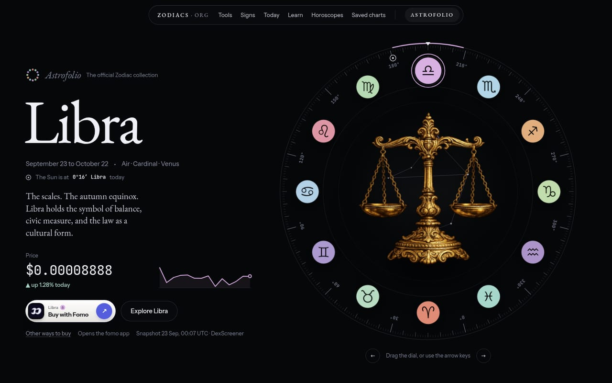 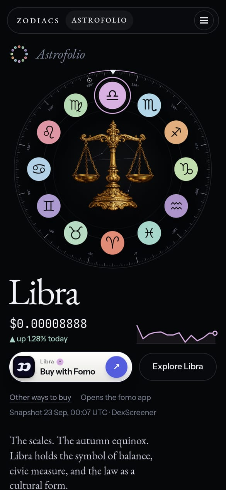

The Astrofolio mark is already a ring of twelve discs with the season's sign at the top. In this option the ring is the sign picker:

- A large ecliptic dial has real degree ticks, from 0° Aries round to 330° Pisces.
- The twelve discs sit on its rim.
- The chosen sign's gold figure sits in the centre, over its constellation map.
- A small marker shows where the Sun actually is. It read 0°16′ Libra when these screenshots were taken.

You choose a sign by tapping a disc, pressing ← →, or dragging the dial. The ring turns until that sign reaches the top, the way the season seal already shows it.

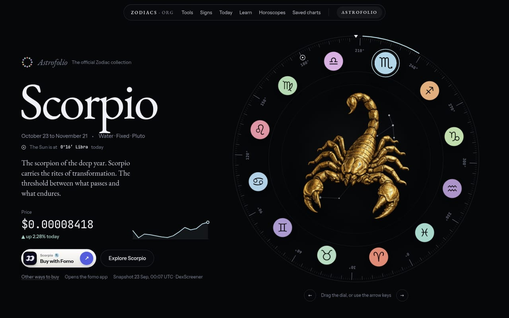

**The rest of the page, in order:**

1. The Libra season band: day 1 of 30, the exact ingress times, and the next sign's figure.
2. The fomo section: the app recording in a phone frame, with the price alert over it.
3. A full-bleed astronomical-clock film.
4. The shop.
5. The address check.
6. The standings.
7. Questions.

- **Strengths:** This is the most on-brand option, because the logo becomes the interaction. It matches DESIGN.md's "precise celestial tool", and computed facts (degrees, UTC times) do the talking.
- **Trade-offs:** Only one sign is on stage at a time, so the overview of all twelve lives on the dial and in the standings. The dial needs careful accessibility work. In the prototype it is twelve buttons plus a drag layer.
- **Build:** A new vitrine component in `src/app.jsx` would replace `VitrineDiscRail` and the stage. The no-JS radios stay as the fallback. Medium to large.

## B · Campaign

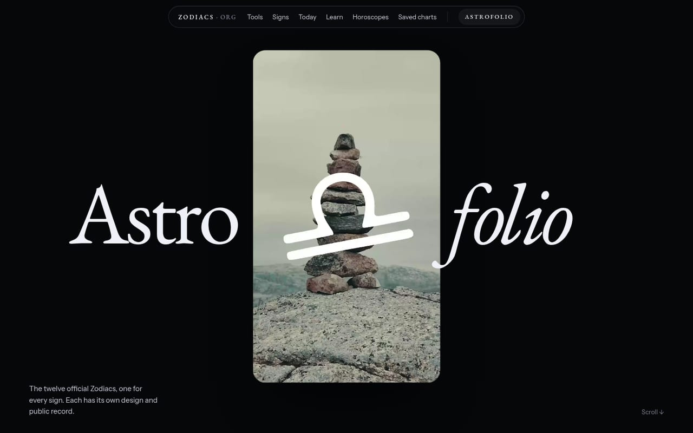 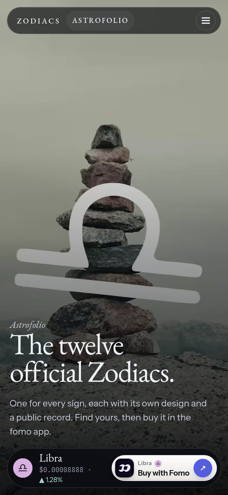

This option treats Astrofolio as a collection launch.

**The hero.** It sets the owner's glyph film from `/fomo/` inside the wordmark: Astro | film | folio. As you scroll, the film opens to full screen and the headline appears over it.

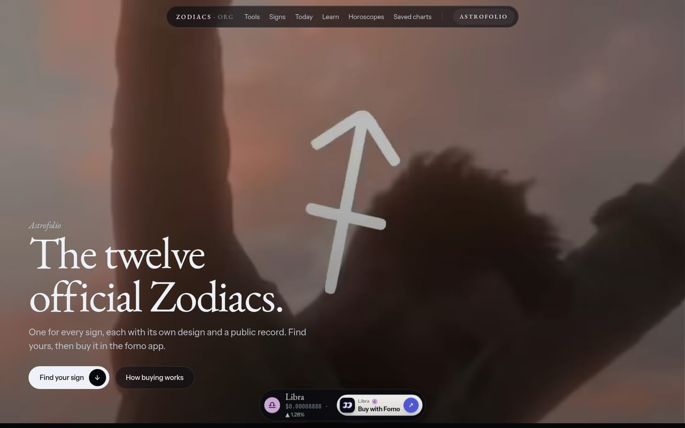

**The runway.** A pinned runway then moves sideways through all twelve signs, starting with the season's sign. Each look shows its figure, price, 14-day line and a Buy with Fomo button.

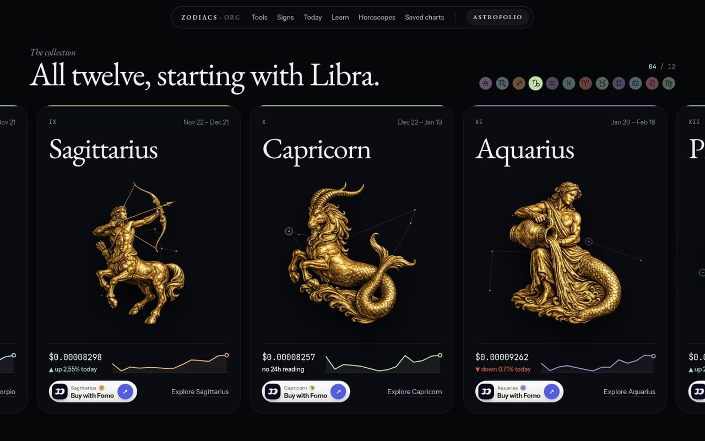

**The app spread.** Three phone screens sit side by side, with the price alert floating over them: the app recording, the friends list, and the thesis screen.

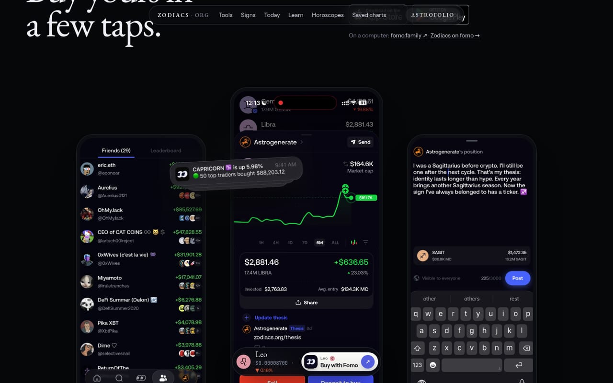

**Further down:**

- a merch lookbook
- the Registry address set large in mono
- a podium of today's leaders

A floating bar follows whichever look you are viewing, with its price and Buy with Fomo button.

- **Strengths:** It uses the most `/fomo/` material, carries the most energy, and makes buying feel native.
- **Trade-offs:** It is the loudest of the four and the closest to the landing-page tone that DESIGN.md warns against. The scroll-driven sections need performance care on low-end phones, and phones get simpler versions without pinning.
- **Build:** This needs a new hero, the runway and the floating bar. On phones, the first-screen Buy test would target the floating bar. Large.

## C · The Salon

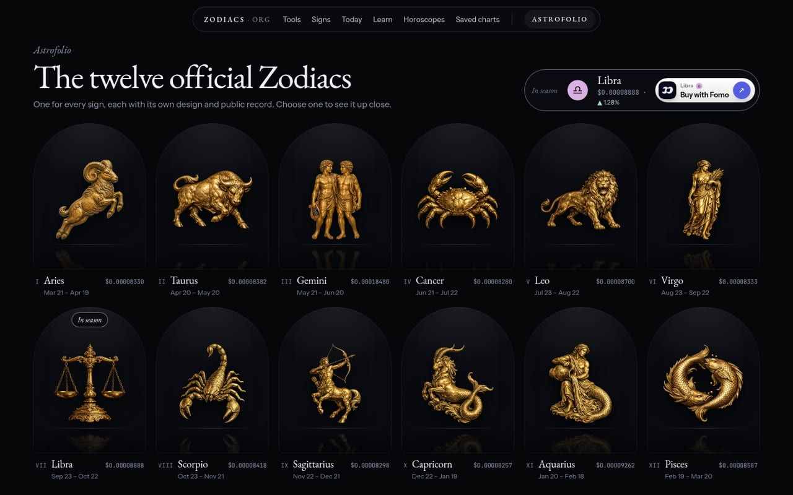 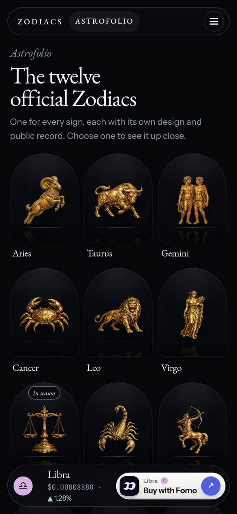

This option stops making people choose blind. All twelve gold figures stand on one wall, each in a lit arched niche with a soft reflection and a placard giving its numeral, name, dates and price. All twelve fit in the first screen at 1440×900, and nine of them on a 390px phone.

**The buy panel.** A Buy with Fomo panel in the header starts on the season's sign. Hovering over a niche switches the panel to that sign.

**The object view.** Tapping a niche opens a full-screen object view, with a shared-element transition where the browser supports it. It shows:

- the figure in a large arch over its star map
- a museum label with the sign's bio, price and 14-day line
- the buy buttons
- a provenance block with both verified addresses

← → steps through the twelve.

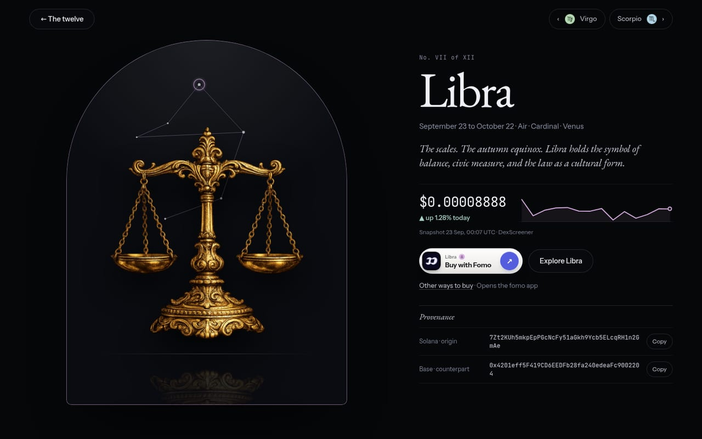

**The rest of the page, in order:**

1. Wall text with three figures: 12 Zodiacs, 24 addresses, 1 Registry.
2. Buying in fomo: the Verified phone render and three steps.
3. The Cabinet of Twelve as a mini wall.
4. The museum shop in arches.
5. Provenance, with the address check.
6. The standings as plinths: each figure stands on a plinth whose height is its reported market cap.
7. The story film.
8. Questions.

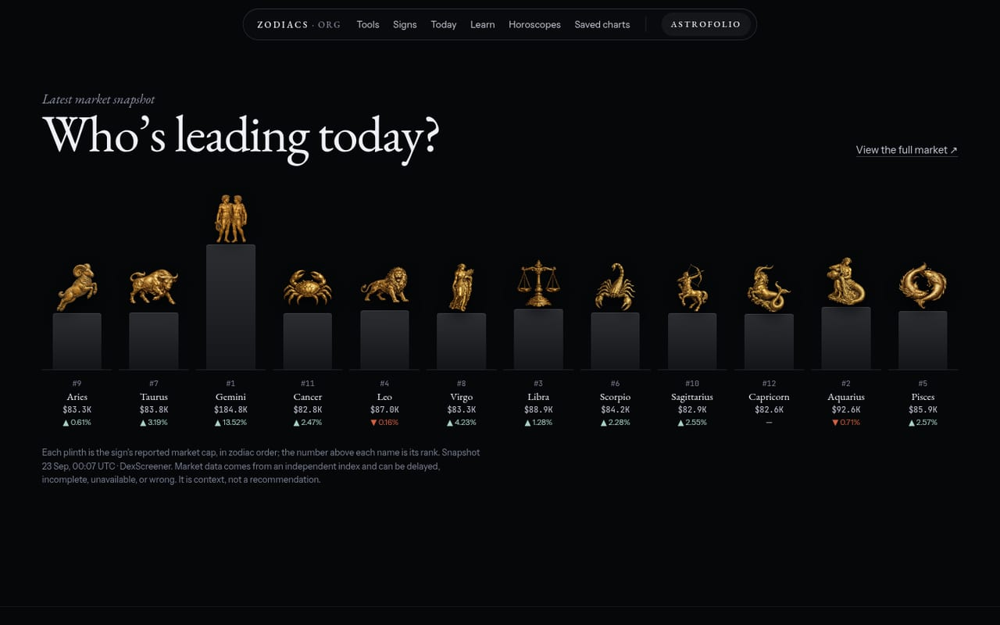

- **Strengths:** It makes the strongest first impression. The museum register fits the wing's voice (catalogue, provenance). It is also the simplest option to build and the most robust on phones.
- **Trade-offs:** The motion is quieter. The in-season sign is flagged rather than staged. The Cabinet link depends on the Registry Collection flag, as it does today.
- **Build:** Mostly CSS on a grid of twelve buttons, plus a `<dialog>`. Medium.

## D · Season Cover

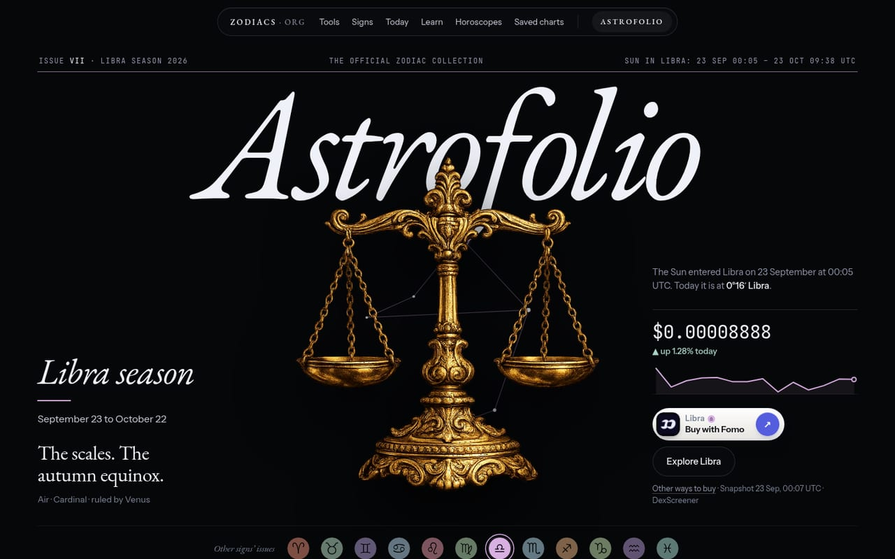 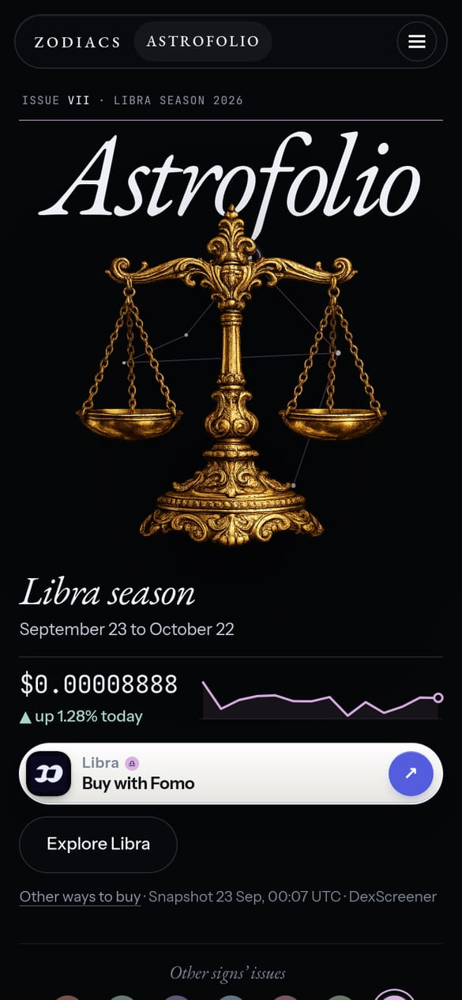

The page already knows whose season it is: `stamp-astrofolio-season.mjs` rewrites the identity for it at build time. This option builds on that: a magazine cover that re-issues itself twelve times a year.

**The cover:**

- a full-width italic masthead, with the season's figure standing in front of it
- cover lines either side: the sign's line, the Sun's exact ingress time, today's price and the buy buttons
- a dateline with the season's exact window in UTC

You can open any sign's issue. The page turns, re-tints to that sign's hue, and shows the dates of that sign's next season.

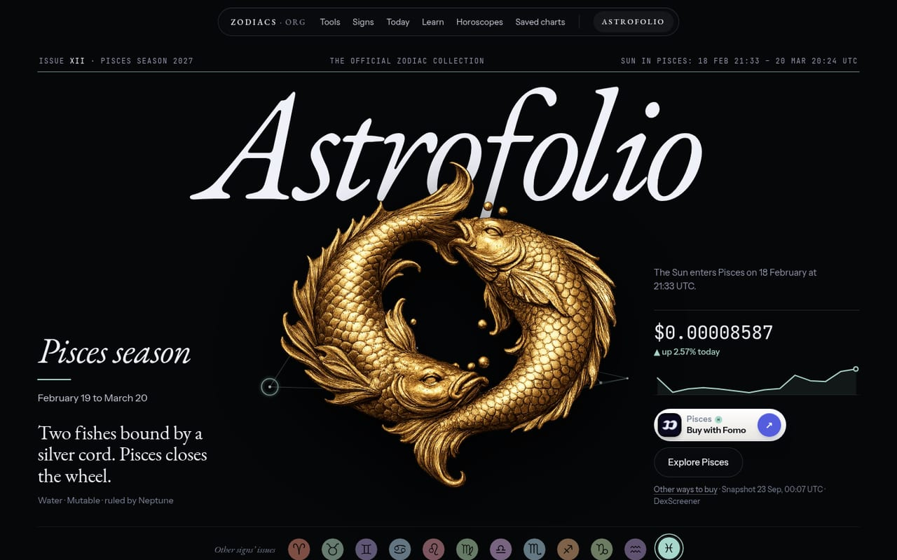

**The rest of the page, in order:**

1. Next issue: the next sign as a silhouette, with a countdown to its ingress.
2. A feature on buying in fomo: the glyph film beside a long-form column, the app recording, and the price alert.
3. All twelve issues as a grid of mini covers.
4. The Astrofolio edit (merch).
5. The fine print, with the address check.
6. A chart of today's leaders.
7. Questions.

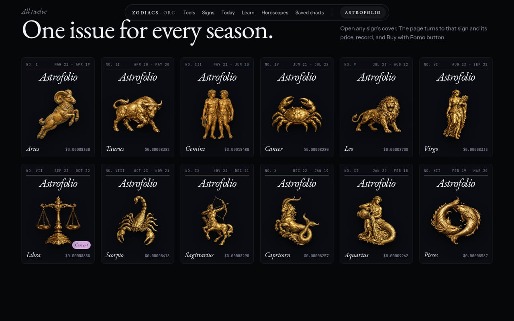

- **Strengths:** It is the most distinctive option and gives people a reason to come back every month. It ties the collection to astrological timing, which is what the rest of the site is about. The season script can stamp the no-JS cover at build time.
- **Trade-offs:** The figure's overlap with the masthead needs tuning per sign, because some figures are wide and some are tall. The magazine idea has to stay light or it becomes a gimmick.
- **Build:** A cover layout, season stamping and the issue grid. Medium.

## Side by side

| | A · Orrery | B · Campaign | C · Salon | D · Season Cover |
|---|---|---|---|---|
| First impression | An instrument | A film | A gallery | A magazine |
| All twelve on arrival | As discs on the dial | No (the runway follows) | Yes | As a row of discs |
| `/fomo/` material used | App recording, alert | Glyph film, app recording, friends, thesis, alert | Verified render | Glyph film, app recording, alert |
| Motion | Dial turn and drag | Scroll-driven hero and runway | Hover, object transition | Page turn |
| On phones | Good | Needs simpler fallbacks | Best | Good |
| Effort | Medium to large | Large | Medium | Medium |

## Recommendation

**Build C, The Salon, as the base.** It makes the strongest first impression for a collection page, because every figure is on screen at once, and it is the least risky to ship. Then add two things from the other options:

1. **From D, the season layer.** Open on the in-season sign, tint the page to its hue, and add the next-season band with its countdown. The season script already does the stamping.
2. **From B, the app spread.** Use it for the fomo section in place of C's single phone render, so the `/fomo/` material is used properly.

If the ring identity matters more than seeing all twelve on arrival, A is the alternative base.

## Considered and set aside

- **The Board:** a live market floor with a market-cap race as the hero. It duplicates the Terminal and breaks the rule that the opening section carries no market-cap wording.
- **The WebGL gallery:** `public/assets/gallery.js` is still defined in `app.jsx` but is not rendered. Its extruded silhouettes are weaker than the renders, and the renders are what make these options work.
- **The Twemoji zodiac tiles from `/fomo/`:** their magenta gradient is off-palette.

## If one goes ahead: what the codebase pins

- **`scripts/registry-consumer-contract.test.mjs`** pins the no-JS shell:
  - the section id order, from `official-twelve` through to `notice`
  - twelve radios, the price placeholders, twelve fomo links and twelve how-to-buy links
  - no `/terminal/` link or market-cap wording in the opening section
  - the seven FAQs, matching the FAQPage JSON-LD
  - the shop URLs, and the hydrated component order
  - a ban on "sculpture(s)" in consumer copy

  Every option can keep the radios as the no-JS fallback. The component-order and code-string assertions change with the redesign.
- **`tests/terminal-split-drive.mjs`** requires the Buy with Fomo button inside the first screen at 390×844 and 375×600, twelve discs of at least 44px, and one batched DexScreener request. A, C and D meet the first two as built. B's first-screen button is the floating bar and B has no disc rail, so that test would be rewritten for it.
- **`scripts/stamp-astrofolio-season.mjs`** (postbuild) rewrites the identity paths and the checked radio for the season. D, and the season layer in the recommendation, can reuse it.
- **`scripts/build-app.mjs`** copies this page's non-split `<style>` blocks into `/terminal/` and `/registry/technical/`. New styles belong in the split-styles file, and a second `<style>` block makes the build throw.
- **`scripts/phase1-scope-guard.mjs`** protects `src/app.jsx`, `public/assets/app.js` and `public/assets/astrofolio/**`. Changing them needs an entry in `.github/phase1-scope-allowance.json`.
- **The CSP** allows only self-hosted images and media. Every asset here is self-hosted.
- **The Sun's position:** the prototypes compute it in the browser with a low-precision formula (about 0.01°). The real page should stamp it at build time and keep prices live through the existing batched DexScreener hook.

## Files

- `index.html`: the four options with previews
- `option-a-orrery.html`, `option-b-campaign.html`, `option-c-salon.html`, `option-d-season.html`: the prototypes
- `shared/base.css` and `shared/common.js`: tokens, fonts, the Buy with Fomo button, the sparkline, the address check, and the footer and notice
- `shared/data.js`: generated by `build-data.mjs` from the Registry, the committed market history, the ingress table and `scripts/site-footer.mjs`. To refresh prices, run `node docs/design/astrofolio-redesign/build-data.mjs`.
- `screenshots/`: captures at 1440×900 and 390×844

Star positions are from the HYG Database v4.0 (CC BY-SA 4.0). The glyph film, the app recording, the renders and the screenshots are the owner's, as used on `/fomo/`.
